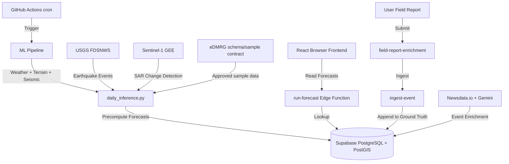

# Avalanche Insight Hub

**Governed ML-augmentation and comparative-validation workbench for avalanche forecasting (pre-production technical-reference prototype).**

**Prototype Deployment:** https://avalanche-insight-hub.netlify.app
**Status:** Technical-reference prototype — calibrated RF + TreeSHAP is the reference path; MTS-LSTM and SAR U-Net remain shadow candidates pending a Partner-governed benchmark.

Avalanche Insight Hub demonstrates batch-first, provenance-aware weather/terrain inference, uncertainty, explainability, and review artifacts. It is designed to compare candidate methods against a customer-nominated baseline; it does not claim Himalayan accuracy, deep-learning superiority, autonomous warning authority, or replacement of Partner systems.

**Partner posture:** The current request is a named capability review and one bounded comparative-validation hypothesis. eDMRG is schema/sample-first; geophone work is conditional on a signal contract; AAVDS and SACHET push are deferred. Partner retains scientific and warning authority.

**Safety First:** Permanent disclaimer on every screen. Use only as an additional tool alongside official bulletins and local knowledge.

---

## Architecture



1. **Frontend**: React (Vite, TypeScript, TailwindCSS + shadcn/ui) + Leaflet & Three.js for interactive technical-reference visualisation. It exposes provenance, uncertainty, explainability, and review states; it is not an official warning console.
2. **Edge API**: Supabase Edge Functions in Deno (`run-forecast`, `trigger-job`, `field-report-enrichment`, `ingest-event`).
3. **ML Backend**: Python with PyTorch (MTS-LSTM), scikit-learn (Random Forest surrogate + SHAP), COSIPY snowpack physics, GNS runout modeling, and multi-hazard assessment. Runs on GitHub Actions with optional Modal.com GPU workers.
4. **Database & Scheduling**: PostgreSQL with PostGIS extension. Background jobs are batch-oriented; the six-hour lane is manual, dry-run technical reference until an approved review gate exists.
5. **Data Sources**: Open-Meteo (weather), USGS FDSNWS (seismic), and optional Sentinel-1/GIBS research inputs. eDMRG is an adapter contract awaiting an approved schema/sample; no production Partner feed is assumed.

### Research modules and maturity boundaries

- **Reference path:** calibrated RF + TreeSHAP, uncertainty, provenance, and batch publication mechanics.
- **Shadow candidates:** MTS-LSTM sequence head and SAR U-Net detection candidate; neither is active or superior by claim.
- **Conditional/scaffolded modules:** snowpack proxies, seismic, multi-hazard, route, CAP/RSS, and adapters require a nominated hypothesis, reviewed local truth, and scientist release decision.

---

## Directory Layout

- `src/` - React frontend code
  - `src/pages/Index.tsx` - Main dashboard orchestrator (modularized, `< 250` lines)
  - `src/hooks/useForecastState.ts` - Central forecast state/loader custom hook
  - `src/lib/` - Domain utilities (risk math, PWA worker logic, API clients)
  - `src/components/` - Presentational UI controls (sidebar, top-bar, maps, legends)
- `supabase/` - Database and API layer
  - `supabase/migrations/` - PostgreSQL schema migration files
  - `supabase/functions/` - Deno Edge Functions
  - `supabase/archive/` - Archived ad-hoc database maintenance SQL scripts
- `backend/` - Python ML training, inference, and evaluation codes
  - `backend/common/` - Core modules (seismic integrator, multi-hazard, snowpack physics, route planner, dual explainability, CAP alerts, etc.)
  - `backend/models/` - ML model implementations (MTS-LSTM, surrogate RF)
  - `backend/tests/` - 129 test files, 170+ frontend tests (Vitest)
  - `backend/daily_inference.py` - Main inference pipeline
- `scripts/` - Shell and Python operational scripts
- `docs/` - System architecture, design specifications, Partner feature inventory, and delivery evidence packs
  - `docs/MVP_V2/Partner_FEATURE_INVENTORY.md` - Complete feature inventory with implementation status
  - `docs/MVP_V2/REGRESSION_AUDIT_REPORT.md` - Full regression audit results
  - `docs/MVP_V2/INTEGRATION_VERIFICATION_REPORT.md` - Cross-phase integration verification

---

## Local Development Quick Start

### Prerequisites

- Node.js 20+
- Supabase CLI
- Docker (required to run local Supabase replicas)

### Steps

1. **Clone & Install Dependencies**:
   ```bash
   npm install
   ```

2. **Configure Environment Variables**:
   Copy the example environment template:
   ```bash
   cp .env.local.example .env.local
   ```
   The `.env.local.example` file contains the public Supabase URL and publishable (anon) key — these are safe for client-side use. For the knowledge graph feature, you also need `VITE_DEMO_MODE=true` to bypass the role gate during local development.

3. **Start Local Supabase Replica**:
   ```bash
   supabase start
   ```

4. **Serve Edge Functions Locally**:
   ```bash
   supabase functions serve --env-file .env
   ```

5. **Start Frontend Dev Server**:
   ```bash
   npm run dev
   ```
   Open `http://localhost:8080` in your web browser.

---

## Testing & Quality Gates

The repository enforces strict testing pipelines locally and in CI:

- **Backend Tests**: 129 pytest test files covering all Partner feature modules:
  ```bash
  .venv/bin/python -m pytest backend/tests/ -q
  ```
- **Frontend Tests**: Powered by Vitest. Run all unit/component specs:
  ```bash
  npm run test
  ```
- **Coverage Reporting**: Generates code coverage metrics for domain logic (`src/lib`):
  ```bash
  npm run test:coverage
  ```
- **Type Check**: Verifies TypeScript compliance (incremental strict mode on `src/lib/`):
  ```bash
  npx tsc --noEmit
  ```
- **Edge Function Tests**: Run Deno test cases:
  ```bash
  deno test --allow-env supabase/functions/trigger-job/index.test.ts
  ```

### Partner Audit Reports

- `docs/MVP_V2/REGRESSION_AUDIT_REPORT.md` — Full backend regression audit (1201 passed, 0 failed)
- `docs/MVP_V2/INTEGRATION_VERIFICATION_REPORT.md` — 7 cross-phase integration paths verified
- `docs/MVP_V2/Partner_FEATURE_INVENTORY.md` — Complete 24-feature inventory with implementation status

---

## QA and Verification Order

When validating a local deployment, proceed in this order:
1. Verify database schema: `supabase/migrations/` push completes cleanly.
2. Verify parameterised cron schedules are active:
   ```sql
   SELECT jobid, schedule, jobname, active FROM cron.job;
   ```
3. Test edge-function JWT authentication boundaries:
   ```bash
   bash scripts/smoke-test.sh
   ```
4. Verify the web app loads cleanly without console warnings and displays mock/precomputed grids correctly.
