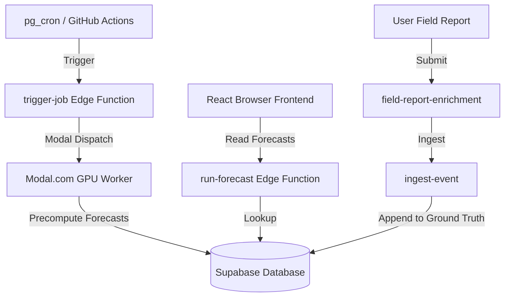

# Avalanche Insight Hub (Avalanche Compass)

**Open-source AI avalanche early-warning system inspired by Google Flood Hub.**

**Live Deployment:** https://avalanche-compass.netlify.app/
**Status:** Pre-production Prototype (v2.0)

Avalanche Insight Hub delivers 24-hour-ahead, region-aware avalanche risk forecasts using real weather + terrain ensemble inference. The system runs an asynchronous precomputation pipeline (weather/terrain model runs on Modal GPU/GitHub Actions, storing results in Supabase) and serves forecasts instantly to the browser. The self-improving Groundsource loop (field reports → realtime Events layer → Daily Gemini/Modal enrichment) continuously updates the training datasets.

**Safety First:** Permanent disclaimer on every screen. Use only as an additional tool alongside official bulletins and local knowledge.

---

## Architecture



1. **Frontend**: React (Vite, TypeScript, TailwindCSS + shadcn/ui) + Leaflet & Three.js for interactive mapping.
2. **Edge API**: Supabase Edge Functions in Deno (`run-forecast` for precomputed grid retrieval, `trigger-job` for dispatching background tasks, `field-report-enrichment` and `ingest-event` for Groundsource submissions).
3. **ML Backend**: PyTorch, scikit-learn, and SHAP. Model training and inference runs on Modal.com GPU worker nodes.
4. **Database & Scheduling**: PostgreSQL with PostGIS extension. Background jobs are scheduled via PostgreSQL's `pg_cron` extension, using parameter settings inside Vault for secure token retrieval.

---

## Directory Layout

- `src/` - React frontend code
  - `src/pages/Index.tsx` - Main dashboard orchestrator (modularized, `< 250` lines)
  - `src/hooks/useForecastState.ts` - Central forecast state/loader custom hook
  - `src/lib/` - Domain utilities (risk math, PWA worker logic, API clients)
  - `src/components/` - Presentational UI controls (sidebar, top-bar, maps, legends)
- `supabase/` - Database and API layer
  - `supabase/migrations/` - PostgreSQL schema migration files
  - `supabase/functions/` - Deno Edge Functions
  - `supabase/archive/` - Archived ad-hoc database maintenance SQL scripts
- `backend/` - Python ML training, inference, and evaluation codes
- `scripts/` - Shell and Python operational scripts (moved from repository root)
- `docs/` - System architecture, design specifications, and delivery evidence packs

---

## Local Development Quick Start

### Prerequisites

- Node.js 20+
- Supabase CLI
- Docker (required to run local Supabase replicas)

### Steps

1. **Clone & Install Dependencies**:
   ```bash
   npm install
   ```

2. **Configure Environment Variables**:
   Copy the example environment template:
   ```bash
   cp .env.example .env
   ```
   Provide valid values for `VITE_SUPABASE_URL`, `VITE_SUPABASE_ANON_KEY`, `SUPABASE_SERVICE_ROLE_KEY`, and other required variables.

3. **Start Local Supabase Replica**:
   ```bash
   supabase start
   ```

4. **Serve Edge Functions Locally**:
   ```bash
   supabase functions serve --env-file .env
   ```

5. **Start Frontend Dev Server**:
   ```bash
   npm run dev
   ```
   Open `http://localhost:8080` in your web browser.

---

## Testing & Quality Gates

The repository enforces strict testing pipelines locally and in CI:

- **Frontend Tests**: Powered by Vitest. Run all unit/component specs:
  ```bash
  npm run test
  ```
- **Coverage Reporting**: Generates code coverage metrics for domain logic (`src/lib`):
  ```bash
  npm run test:coverage
  ```
- **Type Check**: Verifies strict TypeScript compliance:
  ```bash
  npx tsc --noEmit
  ```
- **Edge Function Tests**: Run Deno test cases:
  ```bash
  deno test --allow-env supabase/functions/trigger-job/index.test.ts
  ```

---

## QA and Verification Order

When validating a local deployment, proceed in this order:
1. Verify database schema: `supabase/migrations/` push completes cleanly.
2. Verify parameterised cron schedules are active:
   ```sql
   SELECT jobid, schedule, jobname, active FROM cron.job;
   ```
3. Test edge-function JWT authentication boundaries:
   ```bash
   bash scripts/smoke-test.sh
   ```
4. Verify the web app loads cleanly without console warnings and displays mock/precomputed grids correctly.
