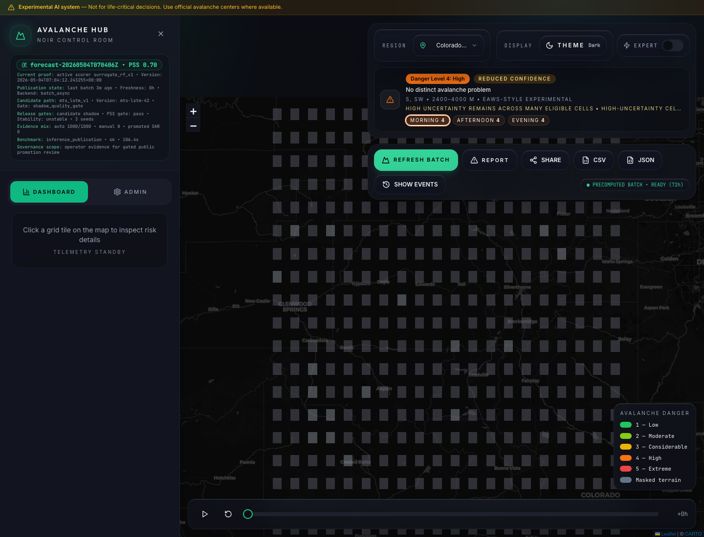
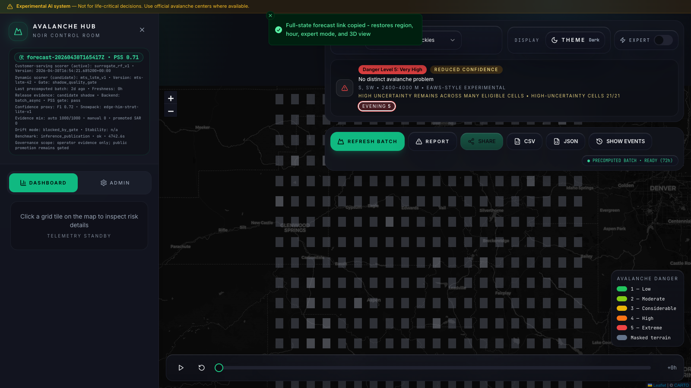
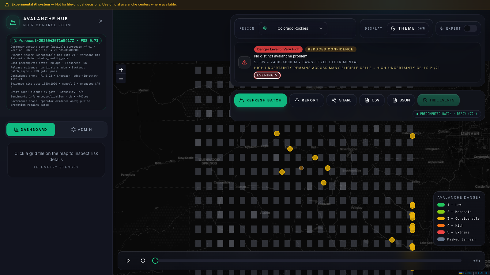
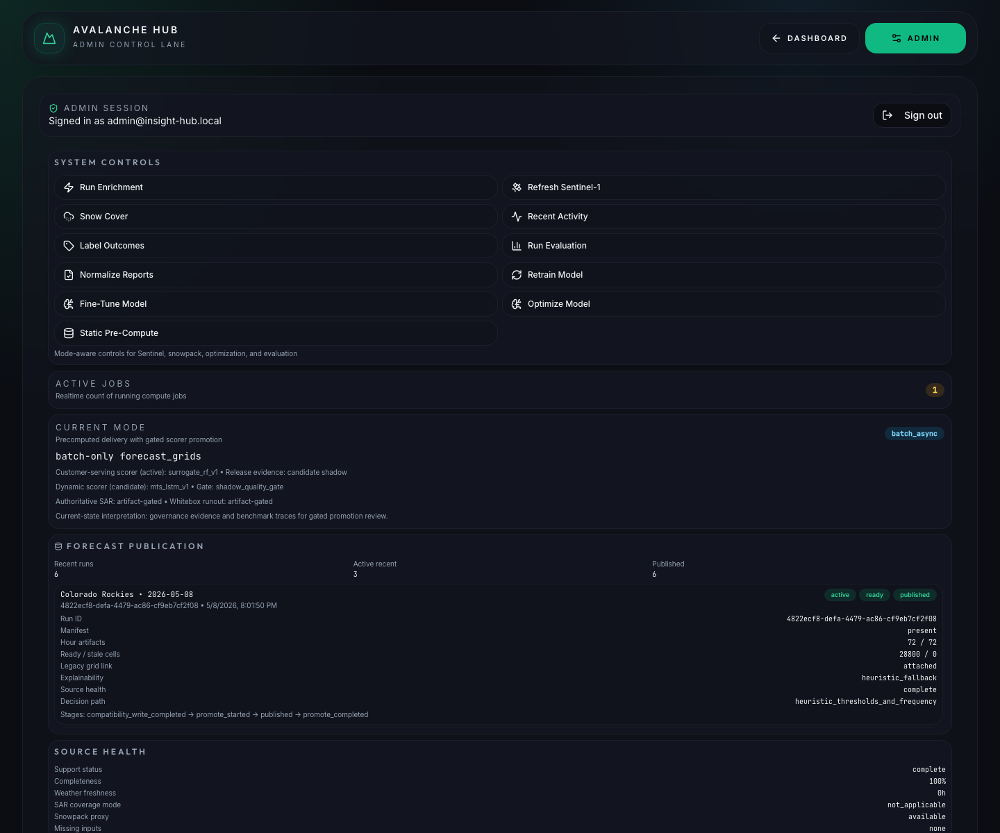

# Deck 1 Final: MVP V2 Proof, Partner Evidence, And Customer Value

## Deck Design System

- Theme: Alpine Trust
- Backgrounds: alternate only between `Light Ice #F6FAFC` and `Deep Pine #102F35`
- Primary accent: `Glacier Blue #2A7FA3`
- Secondary accents: `Signal Amber #C9862B`, `Slate Text #26343A`, `Frost Line #D9E8EE`
- Typography: Inter for body, IBM Plex Sans Condensed for slide titles
- Customer-facing tone: direct technical briefing with a clear current-state and future-strategy line on each slide.
- Asset use: use only screenshots from `assets/screenshots/`.

## Slide 1: Discussion Objective And Meeting Contract

**Background:** Deep Pine
**Customer message:**
This is a governed avalanche decision-support review. The goal is to decide whether the SASE/DGRE partner handoff and next validation phase are worth co-developing with scientists.

**Current state and future strategy:**
- Decision-support platform with autonomy added through governed validation
- Current proof stays separate from Swiss RAvaFcast research, Himalayan v3 partner intake, SAR shadow work, and proposed work
- Validation authority belongs with scientist and operator review
- Meeting output: partner handoff, go/no-go, or scoped validation pilot

**Evidence level:** `Artifact/doc proof only`
**Supporting sources:** [Scientist Discussion Framework](../../source/Scientist_discussion_framework.md), [Demo Decision Brief](../../source/Demo_decision_brief.md)

---

## Slide 2: Why Avalanche Forecasting Remains Hard

**Background:** Light Ice
**Customer message:**
Avalanche forecasting remains hard because the most important signals are sparse, local, rare, and often hidden inside snowpack structure.

**Current state and future strategy:**
- Sparse observations create blind spots
- Rare events make accuracy misleading
- Weak layers carry memory that simple weather windows miss
- Authority-risk communication must be cautious

**Evidence level:** `Artifact/doc proof only`
**Supporting sources:** [Top Challenges](../../source/Top_challanges.md), [Research Base](../../source/Reserches.md)

---

## Slide 3: Client Research Lineage, 2008 To 2025

**Background:** Light Ice
**Customer message:**
The platform builds around a long Himalayan avalanche research lineage rather than claiming that nonlinear forecasting is new.

**Current state and future strategy:**
- 2008: artificial neural network lineage
- 2015: calibration and weighting burden
- 2017: GPU acceleration for expensive calibration
- 2020: HIM-STRAT and snowpack memory (currently implemented as a Weather-Driven Heuristic Proxy; transition to thermodynamic physical modeling is a future-phase target)
- 2025: feature selection and class-imbalance discipline

**Evidence level:** `Artifact/doc proof only`
**Supporting source:** [Research Base](../../source/Reserches.md)

---

## Slide 4: What Research Established And What Remains Open

**Background:** Deep Pine
**Customer message:**
Prior research already established the need for feature discipline, rare-event metrics, and compute separation. Weak-layer science and field validation remain the next proof-building workstreams.

**Current state and future strategy:**
- Established: feature discipline, class imbalance, compute burden
- Implemented: batch-first UX, uncertainty cues, masking, governance surfaces
- Open: critical-layer validation, regional transfer, SAR qualification

**Evidence level:** `Artifact/doc proof only`
**Supporting sources:** [Research Base](../../source/Reserches.md), [Research Appendix](../../source/Demo_research_appendix.md)

---

## Slide 5: What The Hosted Public Route Proves

**Background:** Light Ice
**Customer message:**
The hosted route proves a usable latest-published forecast workspace with structured bulletin semantics, uncertainty cues, explicit terrain masking, and action controls.

**Current state and future strategy:**
- Live route: `https://avalanche-insight-hub.netlify.app/`
- Current proof: same-day full-grid cell publication from `2026-05-08`
- Public route is demoable without admin access
- Full-grid artifact confirms publication freshness and product packaging, but not scientist validation closure

**Evidence level:** `Hosted production`
**Screenshot:** 
**Supporting sources:** [Top 20 Features](../../source/Top20_features.md), [Claim Ledger](../../source/Scientist_claim_ledger.md)

---

## Slide 6: Batch-First Forecast Delivery

**Background:** Deep Pine
**Customer message:**
The architecture keeps heavy avalanche computation off the public click path. The browser hydrates prepared artifacts and shows freshness state.

**Current state and future strategy:**
- Upstream Python jobs prepare forecast artifacts
- Supabase stores metadata and artifact references
- Browser loads only the needed region and hour payloads
- Current proof is a same-day published `72h`, `20x20`, full-grid cell batch
- Next hardening target is scientist validation review over selected full-grid cases

**Evidence level:** `Hosted production` plus `Repo/admin verified`
**Supporting sources:** [Evidence Surface Ledger](../../source/Scientist_evidence_surface_ledger.md), [Current Architecture](../../source/Technical_Architecture_Current_Platform.md)

---

## Slide 7: Bulletin, Uncertainty, And Masking Semantics

**Background:** Light Ice
**Customer message:**
The public route is credibility-forward because it separates danger, uncertainty, and masked terrain instead of flattening all non-danger states into low risk.

**Current state and future strategy:**
- `EAWS-style experimental` bulletin framing
- Reduced-confidence and high-uncertainty cues
- Masked terrain is shown as out-of-scope terrain
- Terrain eligibility is part of the trust model

**Evidence level:** `Hosted production`
**Supporting sources:** [Top 20 Features](../../source/Top20_features.md), [Top Challenges](../../source/Top_challanges.md)

---

## Slide 8: Share, Export, Report, And Expert Review

**Background:** Light Ice
**Customer message:**
The platform extends beyond model viewing. It already supports shared review, reports, and expert-facing workflows, with export tied to loaded artifact state.

**Current state and future strategy:**
- Shareable forecast state
- Report and event workflow
- Export controls remain artifact-dependent
- Expert review is supported as workflow; scientific confidence comes through validation

**Evidence level:** `Hosted production`
**Screenshots:**

**Supporting sources:** [Demo Decision Brief](../../source/Demo_decision_brief.md), [Top 20 Features](../../source/Top20_features.md)

---

## Slide 9: Admin And Operator Evidence Surfaces

**Background:** Deep Pine
**Customer message:**
The operator lane exposes source health, provenance, model status, stability, benchmarks, jobs, reports, evaluation runs, and publication controls.

**Current state and future strategy:**
- Hosted `/admin` route is live
- Hosted authenticated admin smoke succeeded on May 8, 2026
- Admin proof is governance evidence
- Re-run hosted admin smoke before later reuse

**Evidence level:** `Hosted production` plus `Repo/admin verified`
**Screenshot:** 
**Supporting sources:** [Proof Manifest](../06_Proof_Status_And_Screenshot_Manifest.md), [Evidence Surface Ledger](../../source/Scientist_evidence_surface_ledger.md)

---

## Slide 10: Active ML Truth Today

**Background:** Light Ice
**Customer message:**
The active public scoring path is a Random Forest baseline. Swiss RAvaFcast reproduction is research-only, Himalayan v3 partner intake validates package structure and provenance only, and the current active full-grid run uses heuristic explanation fallback.

**Current state and future strategy:**
- Active scorer: `surrogate_rf_v1`
- Current run explanation: `heuristic_fallback`
- TreeSHAP: implemented path, not stronger proof for the current active run
- Candidate path: `mts_lstm_v1`, gated
- Remote-sensing path: SAR candidate, gated
- Modal.com: off-path compute, separate from active public scorer proof
- Swiss RAvaFcast: initial research signal, not paper parity or Himalayan proof
- Himalayan v3 contract: `production_scoring_allowed=false` and `himalayan_accuracy_claim_allowed=false`

**Evidence level:** `Repo/admin verified` plus `Artifact/doc proof only`
**Supporting sources:** [Modal/GPU Evidence Table](../07_Modal_GPU_Evidence_Table.md), [Modal/GPU Inventory](../../source/Modal_GPU_ML_Inventory.md)

---

## Slide 11: Governed Evidence Fusion

**Background:** Light Ice
**Customer message:**
Autonomous evidence enters through weighting, decay, corroboration, and audit-only controls where required.

**Current state and future strategy:**
- `label_confidence`
- `training_weight`
- source weighting
- corroboration and recency decay
- audit-only exclusions

**Evidence level:** `Repo/admin verified` plus `Artifact/doc proof only`
**Supporting sources:** [Governed Autonomy Note](../../source/Governed_autonomy_evidence_fusion_note.md), [Evidence Surface Ledger](../../source/Scientist_evidence_surface_ledger.md)

---

## Slide 12: Benchmark, Stability, And Release Gates

**Background:** Deep Pine
**Customer message:**
The system is designed to block stronger model claims until benchmark, stability, SAR, Himalayan partner evidence, holdout, and activation gates support promotion.

**Current state and future strategy:**
- Current stability evidence is explicit and conservative
- Current artifact evidence includes `unstable`, `3` seeds, and threshold drift
- Runtime benchmarks are observability; field validation remains separate
- Candidate promotion must be earned
- Partner package triage can pass structure and source governance without proving prediction accuracy

**Evidence level:** `Repo/admin verified` plus `Artifact/doc proof only`
**Supporting sources:** [Benchmark Pack](../../source/Scientist_benchmark_pack_v0.md), [Validation Protocol](../../source/Scientist_validation_protocol_v0.md)

---

## Slide 13: Current Differentiation

**Background:** Light Ice
**Customer message:**
The strongest current differentiation is the integrated current-state discipline across forecast UX, uncertainty communication, governance, and off-path candidate compute.

**Current state and future strategy:**
- Batch-first forecast UX
- Masked terrain semantics
- Uncertainty-forward bulletin framing
- Auditable governance lane
- Explicit off-path candidate compute

**Evidence level:** `Hosted production` plus `Artifact/doc proof only`
**Supporting sources:** [Demo Decision Brief](../../source/Demo_decision_brief.md), [Research Appendix](../../source/Demo_research_appendix.md)

---

## Slide 14: Future Strategy Boundaries

**Background:** Light Ice
**Customer message:**
The future strategy is to promote stronger model, sensing, or Himalayan accuracy claims only when field validation, benchmark evidence, local holdouts, and release gates support that promotion.

**Current state and future strategy:**
- Public scoring remains the explainable baseline until promotion gates pass
- SAR remains a qualified candidate until held-out evidence supports promotion
- SASE/DGRE handoff is partner operations, not prediction success
- Official-warning equivalence stays outside customer-facing claims
- Weak-layer science remains a named validation workstream
- Explainability supports review; field validation still decides confidence

**Evidence level:** `Artifact/doc proof only`
**Supporting sources:** [Research Appendix](../../source/Demo_research_appendix.md), [Claim Ledger](../../source/Scientist_claim_ledger.md)

---

## Slide 15: Conditional Validation Ask

**Background:** Deep Pine
**Customer message:**
The right close is a constructive validation decision: choose the SASE/DGRE handoff path, the next proof-building path, and the promotion gates now.

**Current state and future strategy:**
- Option 1: SASE/DGRE handoff session using the v3 README, field dictionary, checksum guide, source manifest template, and blank CSVs
- Option 2: benchmark-design workshop
- Option 3: scoped 90-day validation pilot
- Option 4: deeper co-development track
- Default rule: align claims to available proof

**Evidence level:** `Artifact/doc proof only`
**Supporting sources:** [Scientist Discussion Framework](../../source/Scientist_discussion_framework.md), [Scientist Meeting Checklist](../../source/Scientist_meeting_checklist.md)
