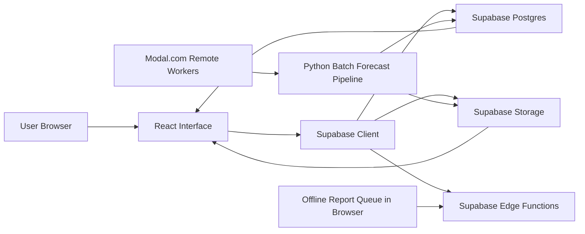

# Technical Architecture: Current Platform

Updated: May 8, 2026

## Audience Note

This document is written for mixed technical audiences:

- avalanche scientists
- software engineers
- machine-learning practitioners
- non-technical stakeholders who still need a clear mental model of the system

Every acronym is expanded on first use. Plain-English explanations are included inline so the platform can be understood without prior experience in web development, machine learning, or avalanche forecasting.

## 1. System At A Glance

Avalanche Insight Hub is a batch-first, web-based decision-support platform.

That means:

- heavy computation happens upstream in scheduled or operator-triggered jobs
- the live website mainly serves already-published forecast artifacts
- the public route focuses on clarity, uncertainty, and reviewability rather than on real-time model execution

## May 8 Hosted Proof Boundary

Use this boundary whenever the architecture is converted into slides:

- hosted `/` and `/admin` are live
- the public route proves a usable current published forecast workspace
- the hosted `run-forecast` proof for Colorado Rockies returns `sameDayPublished=true`, `forecastDate=2026-05-08`, `forecastRunId=4822ecf8-defa-4479-ac86-cf9eb7cf2f08`, `publishedAt=2026-05-08T14:31:50.594343+00:00`, `horizonHours=72`, and `stale=false`
- the May 8 active artifact is a full-grid cell publication: `20x20` grid, `400` ready cells, `0` stale cells, structured bulletin present, `13` dayparts, `data_lineage=observed_or_derived_real`, and `synthetic_inputs_present=false`
- the active artifact uses the Random Forest baseline with heuristic explanation fallback: `skipTreeShap=true`, `tree_shap_status=heuristic_fallback`, and `explainability_mode=heuristic_fallback`
- the active artifact uses analytical Alpha-Beta fallback runout counts: `runout_method_counts={"alpha_beta_elliptical":7}`; WhiteboxTools smoke passed separately, but WhiteboxTools is not the active public runout proof for this run
- hosted authenticated `/admin` proof reached the signed-in observability dashboard on May 8, 2026, and the refreshed screenshot shows the exact active full-grid run id in the operator UI
- the deployed HTML metadata and preview assets now use Avalanche Insight Hub branding

This means the current architecture can be described as a deployed, batch-first decision-support platform with same-day full-grid technical publication proof. It should not be described as scientist-validated, authority-grade, or operationally qualified until the scientist review loop closes.

### Architecture Layers

| Layer | What it does | Main technologies | Plain-English explanation |
|---|---|---|---|
| Interface layer | Renders the public and administration screens in the browser | React, Vite, React Router, Tailwind, Leaflet, Recharts | This is the visible website. It draws the map, bulletin cards, filters, export actions, and administration panels. |
| Data and storage layer | Stores forecast rows, events, reports, and artifact files | Supabase, Postgres, Supabase Storage, Supabase authentication | This is the system of record. It stores structured records in a database and larger files in object storage. |
| Artifact delivery layer | Loads published forecast manifests, hourly grid files, and runout overlays | Supabase Storage, browser download and decompression, JavaScript Object Notation (JSON) artifact manifests | Instead of recalculating the forecast in the browser, the site downloads prepared data packages. |
| Batch compute layer | Builds forecast outputs before publication | Python, scheduled or operator-triggered jobs, weather and terrain feature pipelines | This is the heavy processing path that prepares what the live platform later displays. It matches the PRD direction that heavy math belongs outside Supabase Edge Functions. |
| Machine-learning layer | Scores avalanche hazard and exposes explanation surfaces | Random Forest baseline, Tree SHapley Additive exPlanations (TreeSHAP) implementation path, current heuristic explanation fallback, candidate Multi-Time-Scale Long Short-Term Memory path | This is the model layer. The current live scorer is a tree-based baseline; the deeper sequence model remains a gated candidate. |
| Governance and evaluation layer | Tracks evidence quality, release status, benchmark summaries, and candidate gates | model status summaries, label governance, benchmark artifacts, stability summaries | This layer stops the platform from sounding more certain than the evidence allows. |
| Remote compute layer | Runs heavier candidate-model and remote-sensing workloads away from the web app | Modal.com, Graphics Processing Unit (GPU) training paths, persistent volumes | This keeps larger experiments and remote-sensing jobs off the user-facing click path. |
| Offline reliability layer | Lets field reports queue locally and sync later | Progressive Web App (PWA), Service Worker, Background Sync, IndexedDB | This helps the system keep working when connectivity is weak or intermittent. |

### High-Level Flow

## 2. Step-By-Step Runtime Flow

This section describes what happens in order, from the moment someone opens the live platform.

### Step 1. The user opens the live platform

The website is a **single-page application (SPA)** built with **React** and bundled by **Vite**.

- React is a user-interface library that builds screens from reusable components.
- Vite is a modern web build tool that serves fast development builds and optimized production bundles.

In this repo:

- `src/main.tsx` mounts the application
- `src/App.tsx` defines the two main routes:
  - `/` for the public forecast workspace
  - `/admin` for the administration and observability lane

### Step 2. React renders the interface and route state

Once the page loads, React Router selects the correct screen and the browser begins rendering the forecast workspace or the administration view.

Important pieces at this layer include:

- `src/pages/Index.tsx`
- `src/pages/AdminPage.tsx`
- `src/components/ModelStatusBadge.tsx`

The public route is not a raw developer console. It is a structured working surface with:

- map layers
- time controls
- bulletin cards
- uncertainty and masking cues
- export and share actions

### Step 3. Supabase provides the live data contract

The browser uses the **Supabase JavaScript client** from `src/integrations/supabase/client.ts`.

**Supabase** is a backend platform built around:

- **Postgres**: an open-source relational database
- **authentication**: user sign-in, session handling, and access control
- **Storage**: object storage for files such as published forecast artifacts
- **Edge Functions**: lightweight server-side functions deployed close to users

In this platform, Supabase stores:

- forecast run metadata
- forecast grid metadata
- publication events
- administration summaries
- field reports
- avalanche events
- artifact file references

### Step 4. Forecast artifacts are downloaded and hydrated in the browser

The public route does not calculate the forecast itself. It downloads prepared artifacts from storage.

That artifact flow is implemented in:

- `src/lib/forecastArtifacts.ts`

An **artifact manifest** is a small file that lists:

- what forecast run is being shown
- what hours are available
- where each data file lives
- what optional runout overlay file is attached

This matters because the platform can:

- load only what it needs
- avoid large synchronous recomputation in the browser
- stay responsive even when the forecast package is large

### Step 5. Upstream Python jobs have already prepared the forecast

The forecast artifacts shown on the live route are created earlier by Python jobs, mainly:

- `backend/daily_inference.py`
- `backend/train_model.py`

These jobs handle:

- weather feature generation
- terrain feature generation
- snowpack proxy features
- model scoring
- bulletin generation
- publication metadata
- administration summaries
- artifact writing

This is why the platform is described as **batch-first**:

- the forecast is prepared first
- the website then serves the published output

This matches the architecture direction in `docs/prd_add3.md`: React and Supabase remain the presentation and storage layers, while feature selection, rare-event balancing, inference, and runout physics belong in offline batch processing such as scheduled Python jobs, GitHub Actions, or a lightweight virtual private server. In the current platform, the important architectural boundary is already present: heavy model and geospatial work is not executed inside the public browser route.

### Step 6. The current live scorer is a Random Forest baseline

The current public scorer is `surrogate_rf_v1`.

That scorer is a **Random Forest (RF)** model.

Random Forest means:

- the model uses many decision trees
- each tree learns a slightly different view of the problem
- the final score comes from combining many trees together

Why this is useful here:

- it is practical on sparse tabular data
- it is easier to govern than a fully opaque deep-learning model
- it works well with explanation tooling such as TreeSHAP

The baseline path is implemented in:

- `backend/models/surrogate_rf.py`
- `backend/train_model.py`
- `backend/daily_inference.py`

The current training pipeline also includes:

- **KMeansSMOTE** for rare-event class balancing
- **Recursive Feature Elimination (RFE)** for feature selection
- probability calibration logic
- time-series evaluation splits

Those components are important, but the public-facing headline should remain simple:

- the live platform currently uses an explainable Random Forest baseline

### Step 7. TreeSHAP is implemented, while the active artifact uses fallback explanations

The platform uses **TreeSHAP**, short for **Tree SHapley Additive exPlanations**.

TreeSHAP is an explanation method for tree-based models. It helps answer:

- which features pushed a prediction upward
- which features pushed it downward
- how much each feature contributed locally

In this platform, TreeSHAP is:

- not a separate forecast model
- an explanation layer on top of the active Random Forest baseline

It is wired through:

- `backend/models/surrogate_rf.py`
- `backend/daily_inference.py`
- `src/lib/shapLoader.ts`

Current active-run boundary:

- the active May 8 full-grid run reports `skipTreeShap=true`
- the active May 8 full-grid run reports `tree_shap_status=heuristic_fallback`
- the deck-safe claim is that TreeSHAP is an implemented explanation path and a hardening gate, while the current active public artifact uses heuristic explanation fallback

### Step 8. Administration surfaces expose provenance, benchmarks, and model status

The administration lane exists so the system can show its internal state more honestly.

This includes:

- source health
- decision provenance
- benchmark summaries
- candidate-model status
- stability summaries
- release-gate state

Important files include:

- `src/pages/AdminPage.tsx`
- `src/components/AdminDashboard.tsx`
- `backend/common/model_status_state.py`

This is where the platform distinguishes:

- what is active now
- what is only a candidate
- what remains blocked until stronger evidence exists

### Step 9. Offline field reports can queue locally and sync later

The browser includes offline report handling through a **Progressive Web App (PWA)** pattern.

A PWA is a web application that adds app-like features such as:

- installability
- offline support
- background syncing

This platform uses:

- a **Service Worker**, which is a background browser process that can intercept requests and manage offline behavior
- **IndexedDB**, which is a browser-side database for structured local storage
- the **Background Synchronization API**, which lets deferred tasks run when connectivity returns

Relevant files:

- `src/lib/pwa.ts`
- `src/lib/offlineFieldReports.ts`

This means a field report can be captured even if connectivity is unreliable, then synced later.

## 3. What Is Already Accomplished Technologically

This section focuses only on what is already implemented in a meaningful way.

### A. A usable live forecast platform exists now

The platform already provides:

- a published forecast workspace
- a public route and an administration route
- batch-loaded forecast grids
- bulletin rendering
- region and time controls
- share and export actions

This is more than a model notebook. It is an actual operational web surface.

### B. The platform is designed around precomputed publication artifacts

The current architecture already solves an important product problem:

- heavy computation does not happen inside the public click path

Instead, the platform already supports:

- published artifact manifests
- lazy loading of forecast hours
- optional runout overlays
- storage-backed forecast retrieval

That makes the public route faster and easier to govern.

### C. The current model path is explainable

The platform has already moved beyond an opaque score display.

Implemented now:

- a Random Forest baseline
- an implemented TreeSHAP explanation path
- heuristic explanation fallback on the current active full-grid artifact
- feature selection and calibration logic in the training path

This is important for scientist and developer discussions because:

- the current model can be inspected
- the explanation path is already wired into the product

### D. Governance and release discipline are built into the architecture

The platform already includes:

- candidate-model summaries
- blocked-gate logic
- benchmark summaries
- stability summaries
- release evidence tracking

That is implemented in:

- `backend/common/model_status_state.py`
- `backend/common/label_governance.py`
- the `model_status` records read by the frontend administration surfaces

### E. A governed evidence path already exists

The repo already supports weighted evidence handling through fields such as:

- `label_confidence`
- `training_weight`
- source weights
- corroboration weights
- recency decay

That means the system already has a serious foundation for deciding:

- what evidence should influence training
- what evidence should remain audit-only
- what evidence is too weak for immediate promotion claims

### F. Remote compute scaffolding already exists for heavier workflows

The platform already has a remote worker plane in:

- `backend/modal_worker_app.py`

This supports:

- candidate Multi-Time-Scale Long Short-Term Memory (MTS-LSTM) training
- candidate Multi-Time-Scale Long Short-Term Memory (MTS-LSTM) remote inference
- SAR segmentation
- SAR model training

Important current boundary:

- the active public scorer is still the Random Forest baseline
- the candidate MTS-LSTM and SAR paths are not active public forecast claims

### G. Offline report capture and replay are already implemented

This is a meaningful operational accomplishment because mountain workflows often face weak connectivity.

Implemented now:

- local queueing in IndexedDB
- startup and reconnect flush logic
- Service Worker registration
- deferred replay of report submissions

## 4. New Elements Added Recently

The platform already had a forecast shell, but several newer elements now make it more technically mature.

### 1. Stronger model-status and release-evidence surfaces

The system now exposes clearer status around:

- latest benchmark summary
- candidate readiness
- stability classification
- freshest model-status selection

### 2. Clearer candidate-model separation

The repo now distinguishes more explicitly between:

- the active live scorer
- the candidate MTS-LSTM path
- the candidate SAR path

This reduces the risk of accidentally marketing a research path as a live production feature.

### 3. Better governed evidence framing

The current governance code makes it easier to explain:

- how evidence quality is weighted
- how older evidence decays in influence
- why some records are blocked from training

### 4. Better remote-compute discipline

Modal.com is now framed more precisely:

- GPU-backed for selected training and SAR workloads
- remote but currently Central Processing Unit (CPU) and memory sized for MTS-LSTM inference
- useful for off-path heavy compute, not a reason to claim that the public route already runs on a promoted GPU model

### 5. Better offline reliability for field reporting

The current PWA path gives the platform a more realistic field-reporting story:

- capture locally
- replay later
- avoid losing reports when connectivity drops

## 5. Important Technical Boundaries

These boundaries are important for any scientist or developer discussion.

### Active now

- public web platform on React and Vite
- Supabase-backed database, storage, and authentication
- Python batch forecast pipeline
- Random Forest baseline scorer
- implemented TreeSHAP explanation path with heuristic fallback on the current active artifact
- administration and observability surfaces
- offline report queueing and replay

### Implemented but not promoted

- candidate Multi-Time-Scale Long Short-Term Memory path
- candidate Synthetic Aperture Radar segmentation and training paths
- Modal.com remote compute for heavier candidate workflows

### Not supported as a current claim

- active public MTS-LSTM scoring
- promoted Synthetic Aperture Radar detection
- authority-grade avalanche warning-service status
- solved weak-layer science

## 6. Deck 3 Architecture Source Map

| Architecture topic | Current status | Deck-safe wording |
|---|---|---|
| React/Vite public and admin routes | `Hosted production` | The deployed web app is the presentation and review layer. |
| Supabase data, authentication, and storage | `Repo/admin verified` | Supabase is the system of record for structured records and artifact references. |
| Forecast manifests and hourly artifacts | `Repo/admin verified` plus `Hosted production` | The public route hydrates prepared artifacts and shows freshness state. |
| Random Forest baseline and explanation path | `Repo/admin verified` | The active scorer is governed; TreeSHAP is implemented, but the current active full-grid artifact uses heuristic explanation fallback. |
| Admin observability | `Hosted production` plus `Repo/admin verified` | Source health, provenance, status, stability, and benchmark context are inspectable in the operator lane. |
| Modal.com worker plane | `Repo/admin verified` | Remote compute supports candidate workflows off the public path. |
| MTS-LSTM and SAR | `Repo/admin verified candidate` | Candidate paths are real and gated; they are not current public activation claims. |
| GitHub Actions / lightweight VPS batch architecture | `Proposed architecture direction` | This is the PRD direction for moving heavy mathematical work into low-cost offline batch execution. |
| PostGIS / WhiteboxTools runout expansion | `Proposed architecture direction` | This is a future architecture path until migration and validation artifacts prove it. |

## 7. Official Reference Set

These official or primary sources are the external terminology backbone for this architecture summary:

- [React](https://react.dev/)
- [Vite Getting Started Guide](https://vite.dev/guide/)
- [React Router Routing Guide](https://reactrouter.com/start/declarative/routing)
- [TanStack Query Overview](https://tanstack.com/query/docs/docs)
- [Supabase Documentation](https://supabase.com/docs/)
- [Supabase Edge Functions](https://supabase.com/docs/guides/functions)
- [Supabase Storage](https://supabase.com/docs/guides/storage)
- [MDN Progressive Web App Offline And Background Operation](https://developer.mozilla.org/en-US/docs/Web/Progressive_web_apps/Guides/Offline_and_background_operation)
- [MDN Service Worker API](https://developer.mozilla.org/en-US/docs/Web/API/ServiceWorker)
- [MDN IndexedDB API](https://developer.mozilla.org/en-US/docs/Web/API/IndexedDB_API)
- [MDN Background Synchronization API](https://developer.mozilla.org/en-US/docs/Web/API/Background_Synchronization_API)
- [Modal.com GPU Guide](https://modal.com/docs/guide/gpu)
- [Modal.com Volumes Guide](https://modal.com/docs/guide/volumes)
- [scikit-learn RandomForestClassifier](https://scikit-learn.org/1.5/modules/generated/sklearn.ensemble.RandomForestClassifier.html)
- [SHAP TreeExplainer](https://shap.readthedocs.io/en/stable/generated/shap.TreeExplainer.html)
- [PyTorch LSTM](https://docs.pytorch.org/docs/stable/generated/torch.nn.LSTM.html)
- [PyTorch Performance Tuning Guide](https://docs.pytorch.org/tutorials/recipes/recipes/tuning_guide.html)
- [ESA Sentinel-1 Overview](https://www.esa.int/Sentinel-1)
