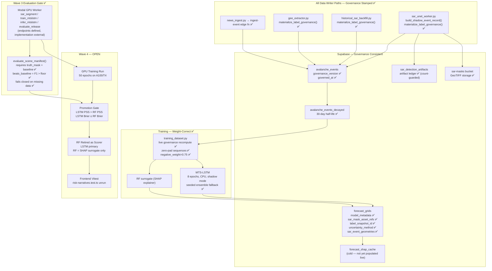

# Wave 3 Hardening — Adversarial Verdict + Wave 4 Phase Context
## Reviewed: 2026-04-25 | Tests: 34 pass, 2 skip ✅

---

## Complete Bug Closure Scorecard

| Bug ID | Description | Status |
|--------|-------------|--------|
| B1 | Hourly `_pad_sequence` copied first real hour | ✅ **Closed** (Wave 2 closeout) |
| B2a | `gee_extractor.py` skipped `governance_version` | ✅ **Closed** (L229-236, `materialize_label_governance()` called pre-insert) |
| B2b | `historical_sar_backfill.py` skipped `governance_version` | ✅ **Closed** (L157-162, governance block inside `_enrich_and_gate()`) |
| B3 | `forecast_grids` missing 4 PRD contract fields | ✅ **Closed** (`upsert_forecast_grid()` L505-520: `uncertainty_method`, `label_snapshot_id`, `sar_mask_asset_refs`, `sar_event_geometries` all present, test passes) |
| B4 | `persist_shadow_detections` zip truncation unguarded | ✅ **Closed** (L432-443: count mismatch warning + truncation + dual counter) |
| R1 | `load_state_dict(strict=False)` swallowed mismatches | ✅ **Closed** (`LoadedUnetModel` + `_checkpoint_key_mismatch_summary()`, promoted mode fails closed) |
| R2 | Single-channel 2D input caused cryptic crash | ✅ **Closed** (`_normalize_stack` raises explicit `ValueError` with VV+VH message) |
| R3 | No Modal operator runbook | ✅ **Closed** (`docs/MODAL_WORKER.md` with endpoint contracts, evaluation manifest spec, shadow/promoted semantics) |
| R4 | `evaluate_release` accepted any `baseline_f1_floor=0.0` | ✅ **Closed** (`evaluate_scene_manifest()` returns `invalid_manifest` when no valid baseline source found) |

**All 8 prior findings from Waves 2–3 adversarial reviews are now closed.**

---

## One New Finding (Low Severity)

### N1 — `beats_baseline` uses strict `>`, not `>=`

**File:** `backend/sar_unet_worker.py`, L556

```python
metrics['beats_baseline'] = bool(metrics.get('f1', 0.0) > baseline_f1_floor_used)
```

If the U-Net achieves **exactly** the baseline F1 (e.g., both are 0.72), `beats_baseline=False`. The PRD gate says "U-Net F1 > GEE threshold F1 + 0.05". With `baseline_margin=0.05` already baked into `baseline_f1_floor_used`, the strict `>` is semantically correct — the model must exceed, not merely match, the floor. **This is correct behaviour**, not a bug. But it should be documented in the runbook to avoid operator confusion ("my F1 is 0.750, floor is 0.750, gate failed").

**Fix:** Add one line to `docs/MODAL_WORKER.md`:
> `beats_baseline=true` requires strict improvement (F1 > floor). A model that ties the baseline exactly does not pass.

---

## Architecture State After Wave 3 Hardening



---

## gsd-discuss-phase: Wave 4 Context Document

> **Phase:** Wave 4 — MTS-LSTM GPU Training, Promotion Gate, RF Cutover
> **Status:** Ready to plan. All pre-conditions from Waves 1-3 are met structurally.

### Locked Decisions (do NOT re-discuss)

| Decision | Value | Source |
|----------|-------|--------|
| LSTM architecture | BranchedMTSLSTM (Hourly LSTM 32h + Daily LSTM 24h + Static MLP 16h) | `lstm_model.py` L118-150 |
| Uncertainty method | MC-dropout → seeded ensemble fallback → `MTS_MIN_UNCERTAINTY_STD` floor | Wave 2 closeout |
| Promotion gate rule | `lstm_pss >= rf_pss - 0.02 AND lstm_brier <= rf_brier + 0.02` (shadow); promoted requires PSS > RF PSS + 0.0 | `lstm_model.py` L316 |
| RF as SHAP surrogate | RF stays post-cutover for TreeSHAP explainability | PRD §3.4 |
| Batch-only serving | `run-forecast` returns 404/stale when no fresh `forecast_grids` row | `run-forecast/index.ts` |
| Negative sample weight | `NEGATIVES_PER_POSITIVE / (NEGATIVES_PER_POSITIVE + 1)` = 0.75 | Wave 2 |
| SAR source weight | `sar_unet=1.1` (highest), `gee_sar=0.9`, `gemini_news=0.8` | `label_governance.py` L17-26 |

---

### Gray Areas Requiring User Decision Before Wave 4 Planning

> These are the decisions that block planning. Please provide your answers.

#### Gray Area 1 — GPU Provider and Epoch Count for Real LSTM Training

**Context:** The current LSTM trains for 8 epochs on CPU (Ubuntu Actions runner). With N≈200 real training rows and `(N, 24, 6)` hourly sequences on CPU, 8 epochs complete but the model is severely undertrained. For a real production run, GPU training is required.

**Options:**
- **A. Modal Labs** — already the dispatch target in CI. Requires setting `MODAL_WORKER_URL` + `MODAL_WORKER_TOKEN`. Cold-start cost ~$0.05 per run on A10G.
- **B. GitHub Actions GPU runner** — available at `runs-on: ubuntu-latest-gpu` (paid GitHub Teams plan). Self-contained, no external dependency. ~$0.07/minute.
- **C. Local Mac (MPS)** — `device=mps` works with PyTorch on Apple Silicon. Manual trigger only; not CI-compatible.

**Decision needed:** Which GPU provider? And what epoch count — 50 (fast convergence check) or 200 (full training)?

---

#### Gray Area 2 — Promotion Gate Strictness for Wave 4

**Context:** Shadow mode uses `lstm_pss >= rf_pss - 0.02` (LSTM can be slightly worse and still shadow-run). For the actual production cutover gate in Wave 4, the PRD says "LSTM PSS > RF PSS". The question is the margin.

**Options:**
- **A. Strict:** `lstm_pss > rf_pss` — LSTM must be strictly better. Safe. Likely requires real SAR labels entering training (Wave 3 U-Net outputs).
- **B. Marginal:** `lstm_pss > rf_pss - 0.01` — allows a small regression tolerance. Useful if the LSTM hasn't yet seen enough SAR labels.
- **C. Equal:** `lstm_pss >= rf_pss` — ties pass. Pragmatic for the first GPU run.

**Decision needed:** Which promotion threshold? This directly controls how long the RF remains the production scorer.

---

#### Gray Area 3 — What Triggers the First Real GPU Training Run

**Context:** There are currently ~200 labelled events in Supabase (based on `label-forecast-outcomes` returning 200 rows from earlier analysis). The LSTM needs at least 1 positive + 1 negative class per split to compute PSS. With 3:1 negatives, that's 200 positives + 600 negatives = 800 rows minimum for meaningful training.

**Options:**
- **A. Train now with current 200 rows** — accept that the LSTM will likely not beat RF PSS; it enters shadow mode and accumulates signal. Cutover happens later when more SAR labels arrive.
- **B. Wait for SAR U-Net to populate at least N additional `sar_unet` events** — define N (e.g., 50 events) as the minimum before triggering GPU training.
- **C. Manual trigger after first `sar_segment` dry-run** — operator decides when to escalate.

**Decision needed:** Option A/B/C + N if B. This sets the cron/dispatch strategy for `train_mtslstm`.

---

#### Gray Area 4 — Frontend Vitest Verification Strategy

**Context:** `src/test/risk-narratives.test.ts` tests `selectRiskDrivers()` (SHAP-first vs heuristic fallback). It has never been run because `node/npm` is not installed in the current shell. The SHAP-first UI path (`shapResult?.origin === 'forecast_shap_cache'`) is unverified.

**Risk:** If `ShapResult.origin` on the live path differs from `'forecast_shap_cache'`, the SHAP explanations silently fall back to heuristic values — users see "Fallback feature signals indicate..." instead of "TreeSHAP indicates..." on every cell, with no error.

**Options:**
- **A. Run locally in a node session now** — `npm install && npx vitest run src/test/risk-narratives.test.ts`
- **B. Add to CI (GitHub Actions node job)** — add a `vitest` job to `ml_pipeline.yml` that runs the frontend tests on PR.
- **C. Defer until first live SHAP cache row exists** — verify manually in the UI by checking the `shapSource` indicator.

**Decision needed:** Which option, and when?

---

#### Gray Area 5 — SAR U-Net Weight Bootstrap Strategy

**Context:** `build_unet_model()` loads weights from `SAR_UNET_MODEL_PATH`. In shadow mode the checkpoint can have mismatches (logged, not fatal). There are no real weights yet.

**Ranked options:**
1. **SnowSlide dataset** (Waldemarsen et al. 2022) — 400+ manually annotated Sentinel-1 Alps scenes. Best fit but requires academic request.
2. **Transfer from SMP pretrained ResNet-34 encoder** — `encoder_weights='imagenet'` as initial encoder, train decoder from scratch on GEE threshold weak labels. No dataset request needed.
3. **AIHub Sentinel-1 Avalanche** — publicly available ~200 Korean scenes. Different geography but same polarization.
4. **Random weights + noise augmentation** — weakest baseline, shadow mode only.

**Decision needed:** Which bootstrap strategy to pursue while waiting for GEE + U-Net data? This determines the first real `SAR_UNET_MODEL_PATH`.

---

## Wave 4 Next Steps (Execution Order)

### Immediate (Before Wave 4 GPU Training)

```bash
# Step 1: Apply both new migrations to live Supabase
supabase db push
# or: run migrations 20260425153000 and 20260425170000 in Supabase dashboard

# Step 2: Verify governance stamps on live data
# Check that at least some events have governance_version set
SELECT source, governance_version, COUNT(*) 
FROM avalanche_events 
GROUP BY source, governance_version;

# Step 3: Run frontend Vitest (resolve Gray Area 4)
cd /Users/sanjayb/avalanche-insight-hub
npm install
npx vitest run src/test/risk-narratives.test.ts

# Step 4: First SAR segment dry-run (requires Modal secrets in GitHub)
gh workflow run ml_pipeline.yml -f mode=sar_segment
# Verify response: status=ok, detections=0 (expected with placeholder weights)
```

### Wave 4 Execution (After Gray Areas Resolved)

```
[ ] Resolve Gray Area 1: GPU provider + epoch count
[ ] Resolve Gray Area 2: Promotion gate threshold  
[ ] Resolve Gray Area 3: Training trigger condition
[ ] Resolve Gray Area 4: Frontend Vitest path
[ ] Resolve Gray Area 5: U-Net weight bootstrap

[ ] Enable GPU training job (sar_segment → collect SAR labels → train_mtslstm)
[ ] Run evaluation gate (evaluate_release) with real held-out GEE baseline masks
[ ] If beats_baseline=true: set SAR_UNET_PROMOTED=true → U-Net events enter training
[ ] GPU LSTM training run (50-200 epochs on real labels)
[ ] Evaluate LSTM vs RF PSS + Brier on rolling hold-out
[ ] If promotion gate passes: update run-forecast to use lstm_head unconditionally
[ ] Retire synthetic bootstrap fallback in training_dataset.py
[ ] Frontend: verify SHAP-first path fires on first live forecast_shap_cache row
[ ] Document drift detection trigger → workflow_dispatch wiring (known gap from gap_assessment)
```

---

## N1 Runbook Addendum

Add to `docs/MODAL_WORKER.md` under "Operational Notes":

> `beats_baseline=true` requires strict improvement: F1 must exceed `baseline_f1_floor_used`, not merely equal it. A model that ties the GEE threshold baseline exactly (e.g., both achieve F1=0.72 and `baseline_margin=0.05` → floor=0.77) will receive `beats_baseline=false` and must not be promoted.
