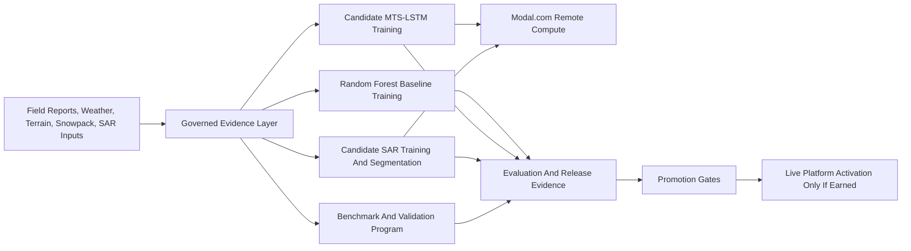

# Technical Architecture: Future Core Model

Updated: May 8, 2026

## Audience Note

This document explains the technical program proposed after the current platform stage.

It is intentionally future-facing, but it does not treat proposed work as if it were already complete.

Use it to discuss:

- what the next technical system should become
- which components already exist in partial form
- what must still be built, validated, and qualified before stronger scientific or operational claims are made

## 1. Starting Point

The current platform already provides:

- a live batch-first forecast surface
- an explainable Random Forest baseline
- administration and governance surfaces
- a candidate Multi-Time-Scale Long Short-Term Memory (MTS-LSTM) path
- a candidate Synthetic Aperture Radar (SAR) path
- a Modal.com remote compute plane for heavier jobs

The future core model is not a single new algorithm.

It is a co-developed technical system made of:

- stronger benchmark design
- scientist-in-the-loop validation
- qualified candidate-model promotion
- remote-sensing qualification
- stricter evidence governance

## 2. Deck 3 Source Map

Use this table to keep the architecture addendum current-state accurate.

| Architecture item | Status for deck use | Evidence source | Deck-safe interpretation |
|---|---|---|---|
| Public React/Vite workspace | `Current` | hosted `/`; current platform architecture | Presentation layer is deployed and usable. |
| Supabase storage, auth, and records | `Current` | current platform architecture; admin route | Storage and operator access are real system components. |
| Forecast artifact hydration | `Current` | hosted May 8 same-day full-grid cell publication; `forecast_runs` and artifact manifests | Public route serves prepared artifacts and freshness state; scientist validation remains separate. |
| Random Forest baseline plus explanation path | `Current plus hardening gate` | current platform architecture; Modal/GPU inventory | Active baseline is Random Forest. TreeSHAP is implemented, but the current active full-grid artifact reports heuristic explanation fallback until the stronger refresh completes. |
| Admin governance surfaces | `Current` plus `Repo/admin verified` | hosted authenticated admin smoke; evidence surface ledger | Operator observability exists and should be dated when used. |
| Offline field-report queueing | `Partial/current` | current platform architecture; source ledgers | Implemented queue-and-replay capability; field reliability still needs deployment-specific smoke. |
| MTS-LSTM candidate | `Candidate/gated` | Modal/GPU inventory; claim ledger | Implemented candidate path that must earn promotion. |
| SAR candidate path | `Candidate/gated` | Modal/GPU inventory; research appendix | Implemented candidate path that needs qualification and release artifacts. |
| GitHub Actions / lightweight VPS batch execution | `Proposed direction` | `docs/prd_add3.md` | Low-cost offline-batch architecture target for heavier math. |
| PostGIS terrain enrichment and simplified `forecast_grids` contract | `Proposed direction` | `docs/prd_add3.md` | Future data-contract simplification; not a replacement for current artifact proof. |
| WhiteboxTools Alpha-Beta runout | `Proposed / exploratory` | `docs/prd_add3.md`; source ledgers | Proposed physical runout path; needs memory-safe implementation and validation. |

## 3. Three-Phase Technical Roadmap

The future architecture should be explained through the existing three-phase scientist collaboration model.

| Phase | Goal | What already exists | What still needs to be built |
|---|---|---|---|
| Phase 1: current-platform hardening | Make the existing platform easier to trust, inspect, and benchmark | Live forecast route, administration surfaces, model status summaries, benchmark and validation starter docs | stronger benchmark packaging, cleaner cross-region evaluation slices, scientist-ready documentation, tighter proof boundaries |
| Phase 2: scientist-in-the-loop validation pilot | Put scientists into the benchmark and review loop instead of using them only as outside reviewers | candidate-model scaffolding, governed event weighting, report capture, evaluation hooks | benchmark ownership, critical-layer review workflow, validation protocol, failure-case review cadence, review dashboards |
| Phase 3: qualification and promotion of stronger candidate paths | Promote only the candidate paths that earn activation through evidence | MTS-LSTM candidate, SAR candidate workflows, release-gate logic, Modal.com remote workers | region-qualified SAR evidence, stronger sequence-model benchmarking, explicit promotion artifacts, broader stability and transfer validation |

## 4. The Future Core Model As A Technical System

The future core model should be described as six connected subsystems.

### A. Benchmark And Validation Subsystem

This subsystem answers the most important scientific question:

- how do we know whether the system is actually improving?

#### What exists already

- benchmark summary fields in model-status outputs
- evaluation infrastructure in the repo
- candidate-model gate logic
- scientist-readiness benchmark and validation starter documents

#### What still needs to be built

- benchmark packs by region and failure type
- acceptance criteria for promotion
- critical-layer and weak-layer review slices
- formal scientist review cadence

#### Why scientists and developers both matter

- scientists define meaningful validation questions
- developers instrument repeatable runs, artifacts, and summaries

#### Evidence needed before stronger claims

- benchmark deltas against the current Random Forest baseline
- documented failure modes
- cross-region performance slices
- review signoff on what counts as good enough for activation

### B. Candidate Sequence-Model Subsystem

The deeper sequence-model path is `mts_lstm_v1`.

This is a **Multi-Time-Scale Long Short-Term Memory (MTS-LSTM)** model.

That means:

- it is a deep-learning sequence model
- it looks at patterns across time, not just a single static row of features
- it can combine shorter and longer temporal windows

#### What exists already

- candidate training and inference code in `backend/lstm_model.py`
- remote worker support in `backend/modal_worker_app.py`
- gate logic in model-status summaries
- shadow-regression and training trigger scripts

#### What still needs to be built

- stronger benchmark evidence against the current baseline
- broader stability evidence across seeds and regions
- promotion artifacts that justify activation
- possibly more efficient remote inference, potentially on Graphics Processing Units, only if needed

#### Why scientists and developers both matter

- scientists help define whether temporal patterns match real avalanche reasoning
- developers make the training, inference, and evaluation paths reproducible

#### Evidence needed before stronger claims

- consistent improvement on benchmark slices
- acceptable calibration and stability behavior
- promotion-gate success
- review that the gains are operationally meaningful, not just statistically interesting

### C. Remote-Sensing Subsystem

The future core model also includes a remote-sensing path built around **Synthetic Aperture Radar (SAR)**.

SAR is a radar imaging method used by satellites such as **Sentinel-1**.

Why SAR matters:

- it works day and night
- it can see through cloud cover
- it can help detect snow-surface changes when optical imagery is not enough

#### What exists already

- SAR segmentation worker code
- SAR training code
- model-family definitions such as U-Net variants
- schema support for SAR artifacts and SAR-derived evidence

#### What still needs to be built

- region-specific qualification
- stronger held-out label sets
- operational rules for when SAR evidence is reliable enough to matter
- better understanding of dry-snow limits, radar shadow, layover, and revisit constraints

#### Why scientists and developers both matter

- scientists judge whether SAR signals correspond to useful avalanche evidence
- developers make the ingestion, segmentation, storage, and qualification workflow repeatable

#### Evidence needed before stronger claims

- held-out evaluation artifacts
- region-by-region qualification
- clear failure taxonomy
- evidence that SAR improves decision quality rather than only adding visual novelty

### D. Governed Evidence-Fusion Subsystem

This subsystem controls how evidence enters training and evaluation.

It is already partially implemented through:

- `label_confidence`
- `training_weight`
- source weighting
- corroboration weighting
- recency decay
- audit-only and weak-training logic

#### What exists already

- weighted evidence derivation in `backend/common/label_governance.py`
- autonomous evidence summaries in `backend/common/model_status_state.py`
- event-source accounting and source contribution summaries

#### What still needs to be built

- stronger review tools for evidence disputes
- more explicit event-quality benchmark loops
- richer source-diversity and freshness reporting

#### Why scientists and developers both matter

- scientists decide what should count as meaningful evidence
- developers implement the rules consistently and transparently

#### Evidence needed before stronger claims

- proof that the governed evidence path improves event quality or coverage
- not just more data, but better trusted data

### E. Remote Compute And Graphics Processing Unit Subsystem

The future core model will continue to depend on remote compute for heavier workloads.

The most important term here is **Graphics Processing Unit (GPU)**.

A GPU is a processor designed to perform many operations in parallel. That makes it especially useful for deep-learning training and large image-processing workloads.

Why a GPU can outperform a regular central processor in this context:

- a **Central Processing Unit (CPU)** is optimized for general-purpose sequential tasks
- a GPU is optimized for many repeated mathematical operations at once
- deep learning and image segmentation often involve large matrix operations that benefit from that parallelism

#### What exists already

- Modal.com worker endpoints
- GPU-backed training and SAR segmentation paths
- persistent Modal volumes for artifacts and model files

#### What still needs to be built

- workload-by-workload cost justification
- stricter evidence for when GPU-backed inference is actually needed
- continued scale-to-zero and cost-discipline controls

#### Why scientists and developers both matter

- scientists help decide whether added compute actually buys meaningful scientific improvement
- developers keep the cost, reliability, and reproducibility under control

#### Evidence needed before stronger claims

- benchmark gains large enough to justify heavier hardware
- cost and latency tradeoff data
- proof that added compute improves scientific quality rather than just model complexity

### F. Promotion And Safety-Gate Subsystem

This subsystem answers a governance question:

- when does a candidate become active?

#### What exists already

- gate logic for blocked and ready states
- stability summaries
- benchmark summaries
- candidate readiness flags

#### What still needs to be built

- a stronger benchmark pack
- activation artifacts trusted by both scientists and engineers
- agreed thresholds for release decisions

#### Evidence needed before stronger claims

- explicit promotion artifact
- benchmark superiority or meaningful tradeoff justification
- reviewed stability
- region-aware qualification

## 5. Future Architecture Flow

## 6. What The Future Core Model Is Meant To Deliver

If the proposed work succeeds, the future system should deliver:

- better benchmark discipline
- stronger weak-layer and critical-layer review
- more trustworthy multi-source evidence capture
- a defensible promotion path for candidate models
- a clearer basis for deciding whether SAR is research-useful in a given region while remaining shadow-gated

Just as important, it should also deliver better reasons to say no.

That means the future system should be able to show when:

- a candidate model is not ready
- a SAR path is still underqualified
- a benchmark slice remains weak
- a region transfer claim is not yet defendable

## 7. What Remains Proposed, Not Completed

The following items remain future work:

- scientist-owned benchmark packs at operational depth
- critical-layer validation closure
- region-qualified SAR promotion
- active public MTS-LSTM scoring
- broad operational proof of autonomous truth generation
- authority-grade avalanche warning-service equivalence

## 8. Official Reference Set

- [Scientist Discussion Framework](./Scientist_discussion_framework.md)
- [Modal.com, GPU, and ML Inventory](./Modal_GPU_ML_Inventory.md)
- [Demo Decision Brief](./Demo_decision_brief.md)
- [Current Platform Architecture](./Technical_Architecture_Current_Platform.md)
- [Technical Glossary And Acronyms](./Technical_Glossary_And_Acronyms.md)
- [Unified PRD Addendum](../../prd_add3.md)
- [Modal.com GPU Guide](https://modal.com/docs/guide/gpu)
- [Modal.com Volumes Guide](https://modal.com/docs/guide/volumes)
- [PyTorch LSTM](https://docs.pytorch.org/docs/stable/generated/torch.nn.LSTM.html)
- [PyTorch Performance Tuning Guide](https://docs.pytorch.org/tutorials/recipes/recipes/tuning_guide.html)
- [ESA Sentinel-1 Overview](https://www.esa.int/Sentinel-1)
- [ESA Sentinel-1 Instrument Page](https://www.esa.int/Our_Activities/Observing_the_Earth/Copernicus/Sentinel-1/Instrument)
