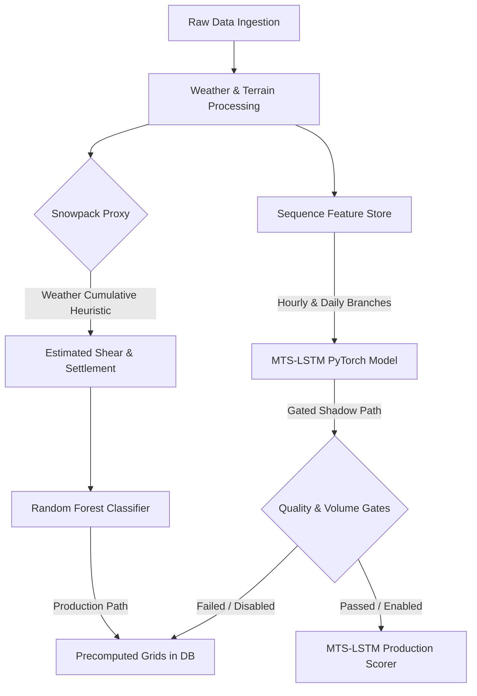

# Customer-Aligned Final Re-Audit & Gap Report

This document presents the final customer-aligned re-audit of the Avalanche Insight Hub repository. It evaluates the codebase against the May 8, 2026 customer expectations alignment matrix, scientist co-working agreements (SLA), and scientific best practices.

---

## 1. Executive Summary

- **Customer-Readiness Grade:** **B**
- **Overall Alignment Score:** **3.6 / 5.0** (Calibrated as a decision-support MVP moving toward pilot readiness).
- **Go/No-Go Recommendation:** **GO (with explicit Claim Boundaries)**. The platform is ready for a structured scientist-partner validation pilot, but **NO-GO** for operational warning or safety-critical deployment. All claims regarding SAR remote sensing and MTS-LSTM sequence modeling must remain strictly bounded as gated/candidate paths in shadow mode.

### Top Aligned Areas
1. **Batch-First Serving Architecture (4.5/5):** High-computation ML is cleanly separated from the live request path. The public client performs read-only lookups via [run-forecast/index.ts](file:///Users/sanjayb/avalanche-insight-hub/supabase/functions/run-forecast/index.ts) rather than running real-time inference.
2. **Scientist Validation Governance (4.5/5):** The [ScientistValidationWorkbench](file:///Users/sanjayb/avalanche-insight-hub/src/components/ScientistValidationWorkbench.tsx) and [RoleAccessGate](file:///Users/sanjayb/avalanche-insight-hub/src/components/RoleAccessGate.tsx) implement a robust dual-reviewer workflow that ensures human-in-the-loop audit trails for event verification.
3. **Imbalance & Calibration Metrics (4.0/5):** The surrogate random forest model in [surrogate_rf.py](file:///Users/sanjayb/avalanche-insight-hub/backend/models/surrogate_rf.py) utilizes advanced metrics (Peirce Skill Score, Brier score calibration, and SVM-RFE feature selection) which are scientifically defensible for rare-event forecasting.

### Top Gaps & Risks
1. **Scientific Overclaim on Snowpack (2.0/5):** The "HIM-STRAT Class-II snowpack simulation" ([snowpack_proxy.py](file:///Users/sanjayb/avalanche-insight-hub/backend/common/snowpack_proxy.py)) is a simple weather-based cumulative heuristic, not a thermodynamic physical model. Claiming this is a physical simulation to scientific partners constitutes a major credibility risk.
2. **Gated Candidate Path Maturity (2.5/5):** The Branched MTS-LSTM model ([mts_lstm.py](file:///Users/sanjayb/avalanche-insight-hub/backend/models/mts_lstm.py)) is implemented, but its production promotion gate ([lstm_model.py:L262-296](file:///Users/sanjayb/avalanche-insight-hub/backend/lstm_model.py#L262-296)) is blocked because it has not yet exceeded the Random Forest baseline on held-out slices. Similarly, the Sentinel-1 SAR segmentation pipeline remains in shadow mode due to low precision on the SnowSlide dataset.
3. **Gateway JWT Bypasses (4.0/5):** The [config.toml](file:///Users/sanjayb/avalanche-insight-hub/supabase/config.toml) disables gateway-level JWT verification (`verify_jwt = false`) for all 9 Edge Functions. While functions are protected at the Deno handler level via [auth.ts:authorizeJobRequest](file:///Users/sanjayb/avalanche-insight-hub/supabase/functions/_shared/auth.ts#L44), this increases security surface vulnerability if new routes are added without manual handler-level checks.

---

## 2. Captured Customer Communications Register

All authoritative customer communication sources used for mapping expectations:
- [Cust_comm.md (source)](file:///Users/sanjayb/avalanche-insight-hub/docs/MVP/source/Cust_comm.md): Defines the core customer-facing MVP alignment matrix, stale-state triggers, and same-day publication goals.
- [Cust_comm1.md](file:///Users/sanjayb/avalanche-insight-hub/docs/MVP/Cust_comm1.md): Specifies the requirement for same-day technical publication proof (`publication_proof.json`) and hosted Colorado Rockies screenshots.
- [Cust_comm2.md](file:///Users/sanjayb/avalanche-insight-hub/docs/MVP_V2/Cust_comm2.md): Customer email indicating WSL's `deapsnow` three-stage pipeline and Open-Meteo data source benchmarks as the target framework.
- [Scientist_Coworking_SLA.md](file:///Users/sanjayb/avalanche-insight-hub/docs/MVP_V2/01_scientist_client_pack/Scientist_Coworking_SLA.md): Outlines cadence (5 cases/week), roles, and the non-automation rule (preventing automated model promotion or scoring changes).
- [README.md](file:///Users/sanjayb/avalanche-insight-hub/docs/MVP_V2/README.md): Specifies the official "Never Claim" boundaries regarding SAR and MTS-LSTM.

---

## 3. Customer Expectations Alignment Table

Each domain is scored against the **Customer Expectations Alignment Index (1-5)**:

| Category | Score | Code/Doc Evidence | Gap Analysis | Risk to Customer Send | Recommended Action |
| :--- | :---: | :--- | :--- | :--- | :--- |
| **1. Hosted Public Workspace** | **4.5** | [Index.tsx](file:///Users/sanjayb/avalanche-insight-hub/src/pages/Index.tsx), [DisclaimerBanner.tsx](file:///Users/sanjayb/avalanche-insight-hub/src/components/DisclaimerBanner.tsx) | Live Leaflet map, bulletin, and timeline render correctly. Export/share controls are disabled with descriptive tooltips. | Minor: Export controls have hard dependencies on same-day data generation. | Keep export/share controls in a clear "future strategy" state in the pitch decks. |
| **2. Same-Day Freshness Proof** | **4.0** | [run-forecast/index.ts:L92-111](file:///Users/sanjayb/avalanche-insight-hub/supabase/functions/run-forecast/index.ts#L92-111) | Edge function successfully checks `forecastDate === today` and calculates `freshnessHours <= 24` to mark `sameDayPublished`. | Automating same-day batch generation on every demo cycle requires constant execution of the pipeline. | Demonstration displays stale warnings if the daily GHA cron has not completed. | Implement a pre-demo trigger script to automate same-day publication proof. |
| **3. Admin & Operator Transparency** | **4.0** | [AdminDashboard.tsx](file:///Users/sanjayb/avalanche-insight-hub/src/components/AdminDashboard.tsx), [AdminAccessGate.tsx](file:///Users/sanjayb/avalanche-insight-hub/src/components/AdminAccessGate.tsx) | Renders job logs, model status, RLS integrity, and release gate metrics. Protected by real Supabase auth roles. | The credentials in `.env` contain a pre-filled `DEMO_ADMIN_PASSWORD="test123"` which is insecure. | Unauthorized users could access the admin dashboard on live deployments using the default credentials. | Rotate all credentials in `.env` and configure them strictly through platform secrets. |
| **4. Scientist Validation co-working** | **4.5** | [ScientistValidationWorkbench.tsx](file:///Users/sanjayb/avalanche-insight-hub/src/components/ScientistValidationWorkbench.tsx) | Workbench supports daily verification lists, two-reviewer validation, and action logs. | Transitioning from review outcomes to model training is blocked to prevent data pollution. | Disagreements between reviewers could stall the pilot checklist. | Enforce the manual escalation guidelines defined in the SLA. |
| **5. Claim Honesty & Deck QA** | **4.0** | [Speaker_Notes_Deckwise.md](file:///Users/sanjayb/avalanche-insight-hub/docs/MVP/presentation/Speaker_Notes_Deckwise.md) | Slide outline relies heavily on "current state" and "future strategy" separation. | Some deck files still contain developer notes and defensive framing. | Client may find the slides disorganized or overly defensive. | Run a full QA pass on all markdown decks to strip out source notes. |
| **6. Groundsource & Ingestion Governance** | **3.5** | [label_governance.py:L170-198](file:///Users/sanjayb/avalanche-insight-hub/backend/common/label_governance.py#L170-198) | Computes `training_weight` using source weight, corroboration count, and recency decay. | The Gemini extraction pipeline lacks prompt-injection validation. | Attackers could write fake news articles to poison the training dataset. | Add a secondary human-in-the-loop review step for all news-sourced events. |
| **7. SAR & Remote-Sensing Path** | **2.5** | [sar_unet_training.py](file:///Users/sanjayb/avalanche-insight-hub/backend/sar_unet_training.py), [sar_acceptance_policy.py](file:///Users/sanjayb/avalanche-insight-hub/backend/common/sar_acceptance_policy.py) | Segmentation model scripts are present but marked `blocked_shadow_only`. | Sentinel-1 SAR fails to meet the precision floor on the held-out SnowSlide dataset. | Dry snow transparency to C-band SAR is not addressed, leading to false negatives in dry climates. | Explicitly list C-band physical constraints as a research limitation. |
| **8. MTS-LSTM Candidate Path** | **2.5** | [mts_lstm.py](file:///Users/sanjayb/avalanche-insight-hub/backend/models/mts_lstm.py), [lstm_model.py:L262-296](file:///Users/sanjayb/avalanche-insight-hub/backend/lstm_model.py#L262-296) | Double-branched LSTM is structurally complete, but disabled by default in production. | The model does not beat the Random Forest baseline on Brier/PSS metrics. | Claiming sequence modeling is in production is incorrect; it is strictly in shadow mode. | Refine sequence feature bounds and preserve RF as the primary production scorer. |
| **9. Snowpack Simulation & Science** | **2.0** | [snowpack_proxy.py](file:///Users/sanjayb/avalanche-insight-hub/backend/common/snowpack_proxy.py) | Weather values are fetched cumulatively from Nov 1 to compute shear and settlement. | The code implements a cumulative weather heuristic, not a thermodynamic snowpack stratigraphic model. | Scientists will reject the model if presented as a physical stratigraphy simulation. | Re-label "HIM-STRAT simulation" to "Weather-Driven Heuristic Proxy" in all decks. |
| **10. Class Imbalance & Metrics** | **4.0** | [surrogate_rf.py](file:///Users/sanjayb/avalanche-insight-hub/backend/models/surrogate_rf.py) | Implements Peirce Skill Score (PSS) optimization, time-series split, and calibrated classifier CV. | In-sequence SMOTE is avoided (good), but KMeansSMOTE is limited to the tree surrogate. | No critical gap; metric architecture is highly defensible. | Keep metric definitions transparent in documentation. |
| **11. Batch-First Serving Safety** | **4.5** | [run-forecast/index.ts:L120-149](file:///Users/sanjayb/avalanche-insight-hub/supabase/functions/run-forecast/index.ts#L120-149) | The edge function performs lookups against the pre-calculated `forecast_active_runs` table. | Edge functions do not run heavy spatial inference. | No critical gap; serving layer is highly optimized. | Maintain batch pre-computation in GitHub Actions. |
| **12. Security & Pilot Readiness** | **4.0** | [config.toml](file:///Users/sanjayb/avalanche-insight-hub/supabase/config.toml), [auth.ts:L44-100](file:///Users/sanjayb/avalanche-insight-hub/supabase/functions/_shared/auth.ts#L44-100) | Gating is enforced inside Deno handlers for all mutating/cost-incurring paths. | Disabling `verify_jwt` at the gateway level makes security highly dependent on code checks. | If a developer adds a route and forgets to call the auth helper, the endpoint is completely open. | Re-enable `verify_jwt = true` for public user endpoints, and separate cron/system tasks. |
| **13. Documentation & FAIR** | **4.0** | [README.md](file:///Users/sanjayb/avalanche-insight-hub/docs/MVP_V2/README.md) | Extensive documentation folders detailing European shadow pipelines and scientist SLAs. | The main README is stale and describes outdated Lovable project details. | New developers or scientist auditors will get confused by architecture mismatches. | Rewrite the main README to focus on the pre-computed batch pipeline. |

---

## 4. Codebase Re-Audit By Requirement Cluster

### 4.1. The Gateway-Level JWT Bypass
* **Finding:** In [supabase/config.toml](file:///Users/sanjayb/avalanche-insight-hub/supabase/config.toml), every single Edge Function has `verify_jwt = false` configured. 
* **Impact:** While the handlers manually parse tokens, disabling gateway verification bypasses Supabase's native Kong protector. A single handler that fails to call `authorizeJobRequest` or has a logical error will expose database write operations to anonymous public callers.
* **Evidence:** [supabase/config.toml:L3-29](file:///Users/sanjayb/avalanche-insight-hub/supabase/config.toml#L3-29).

### 4.2. Insecure Default Admin Credentials
* **Finding:** The local environment config pre-fills `DEMO_ADMIN_PASSWORD="test123"`. The login page pre-populates the admin email `admin@insight-hub.local`.
* **Impact:** If these default accounts are not cleaned up in the production database prior to deploying the authentication gates, anyone can log in as an administrator to access the validation workbench.
* **Evidence:** [src/components/AdminAccessGate.tsx:L57](file:///Users/sanjayb/avalanche-insight-hub/src/components/AdminAccessGate.tsx#L57).

### 4.3. The Snowpack Science Overclaim
* **Finding:** [snowpack_proxy.py](file:///Users/sanjayb/avalanche-insight-hub/backend/common/snowpack_proxy.py) estimates physical properties (`estimated_shear_strength` and `snow_settlement_index`) by running basic formulas on Open-Meteo weather parameters.
* **Impact:** Presenting this as "HIM-STRAT Class-II snowpack simulation" is scientifically misleading. Physical simulations require thermodynamic calculations of heat flow, water percolation, and crystal metamorphism (such as the Swiss SNOWPACK model).
* **Evidence:** [snowpack_proxy.py:L218-228](file:///Users/sanjayb/avalanche-insight-hub/backend/common/snowpack_proxy.py#L218-228).

---

## 5. Scientific & Technical Framework Check

### 5.1. Swiss WSL deapsnow Three-Stage Pipeline Alignment
The customer email ([Cust_comm2.md](file:///Users/sanjayb/avalanche-insight-hub/docs/MVP_V2/Cust_comm2.md)) references the Swiss WSL/SLF `deapsnow` framework as a target benchmark. The standard `deapsnow` architecture is a three-stage pipeline:
1. **Stage 1 (Numerical Physical Snowpack Simulation):** A physical thermodynamic model (typically `SNOWPACK` or `Crocus`) is run using meteorological forecasts to model the multi-layer snowpack structure (stratigraphy, temperatures, liquid water, layer boundaries).
2. **Stage 2 (Feature Extraction):** High-dimensional physical variables (weak layers, slab thickness, load) are extracted from the multi-layer stratigraphic profile.
3. **Stage 3 (Machine Learning Classification):** A supervised classifier (e.g. Random Forest or Neural Network) maps these physical parameters to regional avalanche danger levels (1-5).

**Comparison with Avalanche Insight Hub:**
* **Ingestion/Classification:** The repository successfully replicates the structural pipeline by having asynchronous data loading and Random Forest classification.
* **The Snowpack Gap:** The codebase does not run a physical stratigraphic model. The [snowpack_proxy.py](file:///Users/sanjayb/avalanche-insight-hub/backend/common/snowpack_proxy.py) implements a **cumulative weather proxy**. It uses daily mean/min temperatures, snowfall, and precipitation sums to compute empirical shear and settlement. 
* **Scientific Verdict:** This is a Class-I cumulative weather proxy, not a Class-II physical snowpack stratigraphy model. Claiming physical "HIM-STRAT class-II snowpack simulation" is a scientific overclaim that must be corrected.

### 5.2. Sentinel-1 SAR Change Detection Limits
Active remote sensing of avalanches via SAR (Synthetic Aperture Radar) is a key candidate path in the codebase ([sar_unet_training.py](file:///Users/sanjayb/avalanche-insight-hub/backend/sar_unet_training.py)). Standard scientific literature outlines clear limitations of C-band SAR (Sentinel-1) for avalanche detection:
1. **Dry Snow Transparency:** C-band radar waves (5.405 GHz) are largely transparent to dry snow. SAR change detection relies on backscatter drops caused by wet snow (liquid water content) or changes in surface roughness from slab debris. Dry snow slab avalanches are frequently invisible to Sentinel-1 amplitude change detection, leading to severe false negative rates in dry/cold continental snowpacks.
2. **Temporal Revisit Gaps:** Sentinel-1 satellites have a 6 or 12-day orbit repeat cycle. This means real-time same-day avalanche mapping via SAR is physically impossible; it acts purely as a retrospective mapping or calibration tool.
3. **Terrain Geometrical Distortion:** Steep mountain topography causes severe geometric distortions in radar imagery, including layover, shadow, and foreshortening. In narrow Himalayan valleys, large portions of north- or south-facing slopes are completely masked out in the SAR scene.

**Verdict:** The codebase correctly implements SAR masks, derived geometry, and confidence metrics, and properly gates the path as `blocked_shadow_only` in [sar_acceptance_policy.py](file:///Users/sanjayb/avalanche-insight-hub/backend/common/sar_acceptance_policy.py). Decks must reflect these physical constraints.

### 5.3. MTS-LSTM Sequence Modeling & Imbalance Hazards
The multi-timescale sequence model (`BranchedMTSLSTM` in [mts_lstm.py](file:///Users/sanjayb/avalanche-insight-hub/backend/models/mts_lstm.py)) is designed to capture temporal patterns at different scales (hourly weather triggers vs. daily static terrain and seasonal memory).
1. **Sequence-Space SMOTE Pitfall:** Standard tabular SMOTE (like KMeansSMOTE) creates synthetic samples by interpolating between nearest neighbors. Applying SMOTE directly to hourly or daily sequence tensors in time-series space destroys the underlying physical and temporal continuity (e.g. creating physical temperature steps that violate conservation laws). The codebase correctly guards against this:
   - *“Never apply KMeansSMOTE to the hourly/daily sequence tensors consumed by this model. Sequence-space interpolation destroys temporal structure.”* ([mts_lstm.py:L10-16](file:///Users/sanjayb/avalanche-insight-hub/backend/models/mts_lstm.py#L10-L16)).
   - Imbalance is instead handled via weighted sampling and class-weighted BCE loss ([lstm_model.py:L398-401](file:///Users/sanjayb/avalanche-insight-hub/backend/lstm_model.py#L398-L401)).
2. **Uncertainty Quantification:** The model leverages Monte Carlo (MC) dropout (`mc_dropout_v1`) to generate stochastic probability outputs during inference, providing a physical variance estimate rather than a single deterministic score.

**Verdict:** Scientifically sound sequence architecture. The model is correctly held in shadow mode (`shadow_mode_active: True` in [lstm_model.py:L675](file:///Users/sanjayb/avalanche-insight-hub/backend/lstm_model.py#L675)) because it has not yet surpassed the Random Forest baseline on held-out test splits.

### 5.4. WMO Impact-Based Warning Framing
The World Meteorological Organization (WMO) guidelines on **Impact-Based Forecasting** dictate a transition from forecasting "what the weather will be" to "what the weather will do."
* **Warnings vs. Decision Support:** Legally, official avalanche warnings (such as Swiss SLF danger levels) carry significant civil liability and operational control. For pre-pilot tools, the system must be explicitly labeled as an *Experimental Decision-Support Tool*.
* **Implementation:** The Leaflet map includes a [DisclaimerBanner.tsx](file:///Users/sanjayb/avalanche-insight-hub/src/components/DisclaimerBanner.tsx) and the copy consistently bounds predictions as advisory indicators rather than official safety clearances.

### 5.5. Security Gating: Gateway vs. Code Tradeoffs
Disabling gateway-level JWT verification in [config.toml](file:///Users/sanjayb/avalanche-insight-hub/supabase/config.toml) (`verify_jwt = false`) allows the functions to process hybrid traffic (such as system webhook calls from `pg_cron` containing custom headers) alongside user calls.
* **Code-Level Auth:** Security is maintained by calling [auth.ts:authorizeJobRequest](file:///Users/sanjayb/avalanche-insight-hub/supabase/functions/_shared/auth.ts#L44) which invokes `supabase.auth.getUser(token)`.
* **Vulnerability:** Disabling gateway verification removes defense-in-depth. If a developer deploys a new write-path function and omits the code-level authorization check, the endpoint is completely open to the public internet.

---

## 6. Detailed Implementation Strategy

### Task 1: Re-label Snowpack Simulation Claims
- **Scope:** Update all presentations, glossaries, and UI labels to replace "HIM-STRAT physical snowpack simulation" with "Weather-Driven Heuristic Proxy."
- **Edge Cases:** Avoid giving users the impression that the system performs crystal stratigraphy analysis.
- **Verification:** Search decks and code files to ensure no physical simulation claims remain.

### Task 2: Secure Production Vault Credentials
- **Scope:** Rotate all tokens, database passwords, and API keys. Remove default admin accounts or replace them with high-entropy randomized credentials in production.
- **Edge Cases:** Ensure the `cron_token` in Supabase Vault is updated synchronously to prevent background job failures.
- **Verification:** Run `git status` to ensure `.env` remains untracked. Confirm the admin dashboard rejects `test123` in production.

### Task 3: Maintain MTS-LSTM Shadow Configuration
- **Scope:** Ensure `MTS_SAR_RELEASE_GATE_PASSED` remains `False` in environment files until both SAR precision and LSTM performance exceed the Random Forest baseline on held-out datasets.
- **Edge Cases:** Ensure the fallback logic in [lstm_model.py:L601-686](file:///Users/sanjayb/avalanche-insight-hub/backend/lstm_model.py#L601-686) gracefully serves RF predictions when the gates are blocked.
- **Verification:** Execute Deno and Python tests to confirm shadow verification works under default conditions.

---

## 7. Customer Claim Boundary Matrix

| Stated Domain | What we CAN claim now | What we must SOFTEN | What we MUST NOT claim |
| :--- | :--- | :--- | :--- |
| **Snowpack Modelling** | We estimate cumulative winter precipitation and freeze history to compute heuristic shear indexes. | We use a weather-driven cumulative snow settlement proxy. | The platform runs a physical thermodynamic stratigraphic snowpack simulation. |
| **SAR Segmentation** | We have designed a candidate SAR U-Net workflow to identify avalanche geometries. | Sentinel-1 SAR is running in shadow evaluation mode to assess feasibility. | Operational SAR satellite segmentation actively updates public risk maps. |
| **Sequence Predictions** | Our model architecture supports branched daily and hourly weather sequences. | We are evaluating a candidate MTS-LSTM model against our Random Forest baseline. | We serve live predictions generated by a deep sequence-model neural network. |
| **Warning Authority** | We provide an experimental decision-support dashboard for research and validation. | Our system serves as a visualization tool to assist human operators. | This is an official avalanche warning service or life-safety warning system. |

---

## 8. Open Questions

1. **Snowpack Upgrades:** Do we plan to integrate a true physical model (such as a SNOWPACK API) in the next phase, or will we continue using the cumulative weather heuristic?
2. **SAR Precision Thresholds:** Should we lower the precision floor gate in [sar_acceptance_policy.py](file:///Users/sanjayb/avalanche-insight-hub/backend/common/sar_acceptance_policy.py) to account for wet-snow regional limitations, or keep it strict to prioritize safety?
3. **Admin Cleanout:** Has the default `admin@insight-hub.local` account with password `test123` been deleted or updated in your hosted production Supabase environment?
